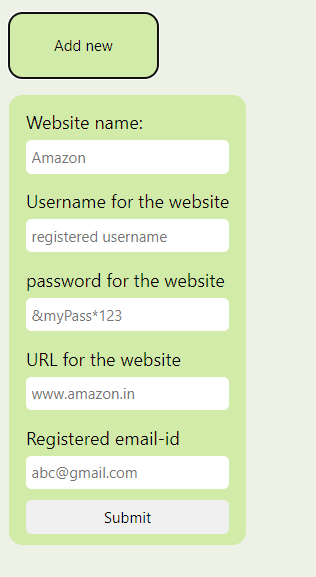
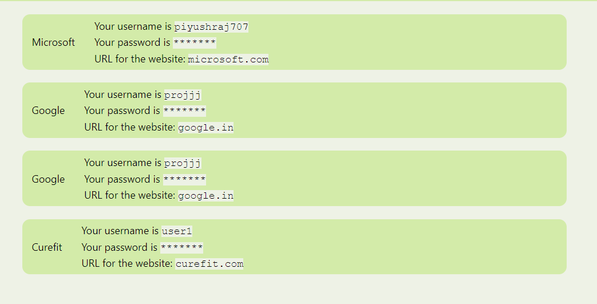
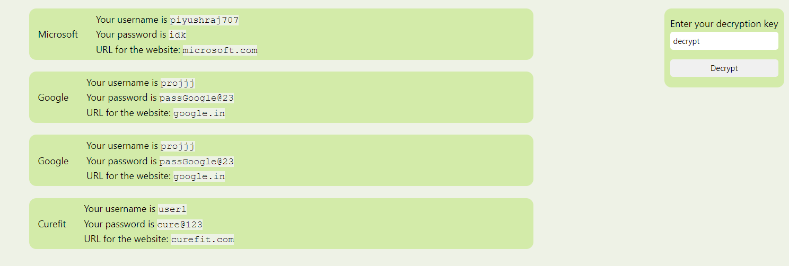

# Introduction
Remembering passwords of so many different websites can be overwhelming. They can be saved in some note taking app but they are not encrypted and can be accessed by anyone. Online Password Managers can be used but most of them requires you to carry a very long string of computer-generated characters which can not be rememeberd and also can be recovered if forgotten.\
This password manager solves this problem by letting the user to choose its own private key to decrypt passwords and they can be accessed from anywhere.

# UI of the app
### Add a new entry

### Show all the entries (Encrypted)

### Show all the entries (Decrypted)

# How the encryption-decryption work?
Encryption-decryption is based on **RSA algorithm**.
### Steps for creating encryption and decrption keys.
1. Get private/decryption key (say $d$) from user when the user is registering for the first time.
2. Generate two large prime numbers p and q (~100 digits each) such that $gcd(d, (p-1)(q-1)) == 1$
3. Encryption/public key can be generated using the relation: $ de \equiv 1 (mod(p-1)(q-1)) $. In other words, encryption key $e$ is an inverse of $d$ modulo $(p-1)(q-1)$.
4. While making sure $p$ and $q$ are individually lost, publc keys $n = pq$ and $e$ are stored in the user's database.

### Steps for encryption and decryption of messages.
1. Text passwords are converted to numeric forms (say m).
2. Encrypted password $c$ is created as: $c = m^e (mod\ n)$ and then stored to the database.
3. For decryption, m is recovered from $c$ using the user-provided decryption key, $d$ as: $ c^d \equiv  (m^e)^d \equiv  m^{1+k(p-1)(q-1)} \equiv  \ m (mod\ n)$.

### Example
1. Suppose the user chooses $d = 15$ as the decryption key.
2. Two prime numbers are generated - $p=17$ and $q = 23$. Note that $gcd(d, (p-1)(q-1)) = gcd(15, 352) = 1 $.
3. Encryption key is generated as $e \equiv d^{-1}(mod\ (p-1)(q-1)) \equiv 15^{-1}(mod \ 352) = 47 $.
4. Public key $n = pq = 17*23 = 391$ is generated and stored to the database. We don't need p and q from now on so they are lost to make sure that the decryption key cannot be generated.
4. Suppose the password to be encrypted is $m = 123 $
5. Create and save the encrypted password as: $c = m^e (mod\ n) = 123^{47} (mod \ 391) = 98$.
6. To recover the encrypted password: $ m = c^d (mod\ n) = 98 ^ {15} ( mod \ 391)  = 123 $. Thus we have successfully recovered the original password.

\
\
\
\
\
\
\
\
\
\
\
\
\
\
.

# Getting Started with Create React App

This project was bootstrapped with [Create React App](https://github.com/facebook/create-react-app).

## Available Scripts

In the project directory, you can run:

### `npm start`

Runs the app in the development mode.\
Open [http://localhost:3000](http://localhost:3000) to view it in your browser.

The page will reload when you make changes.\
You may also see any lint errors in the console.

### `npm test`

Launches the test runner in the interactive watch mode.\
See the section about [running tests](https://facebook.github.io/create-react-app/docs/running-tests) for more information.

### `npm run build`

Builds the app for production to the `build` folder.\
It correctly bundles React in production mode and optimizes the build for the best performance.

The build is minified and the filenames include the hashes.\
Your app is ready to be deployed!

See the section about [deployment](https://facebook.github.io/create-react-app/docs/deployment) for more information.

### `npm run eject`

**Note: this is a one-way operation. Once you `eject`, you can't go back!**

If you aren't satisfied with the build tool and configuration choices, you can `eject` at any time. This command will remove the single build dependency from your project.

Instead, it will copy all the configuration files and the transitive dependencies (webpack, Babel, ESLint, etc) right into your project so you have full control over them. All of the commands except `eject` will still work, but they will point to the copied scripts so you can tweak them. At this point you're on your own.

You don't have to ever use `eject`. The curated feature set is suitable for small and middle deployments, and you shouldn't feel obligated to use this feature. However we understand that this tool wouldn't be useful if you couldn't customize it when you are ready for it.

## Learn More

You can learn more in the [Create React App documentation](https://facebook.github.io/create-react-app/docs/getting-started).

To learn React, check out the [React documentation](https://reactjs.org/).

### Code Splitting

This section has moved here: [https://facebook.github.io/create-react-app/docs/code-splitting](https://facebook.github.io/create-react-app/docs/code-splitting)

### Analyzing the Bundle Size

This section has moved here: [https://facebook.github.io/create-react-app/docs/analyzing-the-bundle-size](https://facebook.github.io/create-react-app/docs/analyzing-the-bundle-size)

### Making a Progressive Web App

This section has moved here: [https://facebook.github.io/create-react-app/docs/making-a-progressive-web-app](https://facebook.github.io/create-react-app/docs/making-a-progressive-web-app)

### Advanced Configuration

This section has moved here: [https://facebook.github.io/create-react-app/docs/advanced-configuration](https://facebook.github.io/create-react-app/docs/advanced-configuration)

### Deployment

This section has moved here: [https://facebook.github.io/create-react-app/docs/deployment](https://facebook.github.io/create-react-app/docs/deployment)

### `npm run build` fails to minify

This section has moved here: [https://facebook.github.io/create-react-app/docs/troubleshooting#npm-run-build-fails-to-minify](https://facebook.github.io/create-react-app/docs/troubleshooting#npm-run-build-fails-to-minify)
